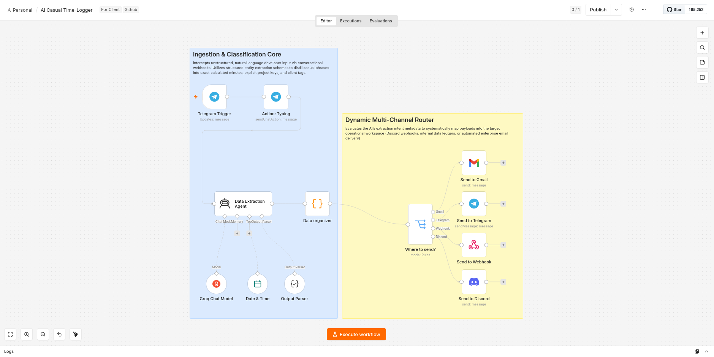

# 📅 AI Casual Time-Logger & Multi-Channel Invoice Engine

[](https://n8n.io/)
[](https://developer.mozilla.org/)
[](https://groq.com/)

An intelligent, event-driven backend automation engine built on **n8n** designed to eliminate the friction of manual developer time-tracking. The system intercepts messy, unstructured natural-language messages sent casually from mobile endpoints (like Telegram) or webhooks, extracts precise numerical variables and metadata using an advanced LLM agent, and dynamically routes polished corporate logs across an omnichannel distribution array.

---

## 🏗️ System Architecture Overview

The framework handles incoming streams linearly before passing them to a decoupled multi-destination router layer to maximize runtime resilience:

<p align="center">
  
</p>

```text
 [ Inbound Chat / Webhook Trigger ]
                 │
                 ▼
 ┌──────────────────────────────┐
 │   Telegram Send Chat Action  │ ◄─── (Immersive "Typing" UX Feedback Loop)
 └───────────────┬──────────────┘
                 │
                 ▼
 ┌──────────────────────────────┐
 │    Data Extraction Agent     │ ◄─── (Groq LLM Semantic Mapping)
 └───────────────┬──────────────┘
                 │
                 ▼
 ┌──────────────────────────────┐
 │    JavaScript Normalizer     │ ◄─── (Batch-Safe Schema Collector)
 └───────────────┬──────────────┘
                 │
                 ▼
 ┌──────────────────────────────┐
 │   Multi-Channel Router Matrix│ ◄─── (Dynamic Destination Selection)
 └───────────────┬──────────────┘
                 │
      ┌──────────┼──────────┬──────────┐
      ▼          ▼          ▼          ▼
 ┌─────────┐┌──────────┐┌─────────┐┌─────────┐
 │  Gmail  ││ Telegram ││ Webhook ││ Discord │
 └─────────┘└──────────┘└─────────┘└─────────┘
```

### 1. Ingestion & Semantic Processing Core
Listens for unstructured, conversational messages. To prevent the perception of AI latency, it instantly fires a programmatic typing state to the user interface, while an LLM agent extracts chronological data points, client names, and descriptions.

### 2. Multi-Channel Router Matrix
Takes the clean, structured output object and evaluates the destination intent parameters. The engine programmatically parses the message variables and dispatches stylized alerts tailored specifically to the target channel APIs.

---

## 🛠️ Advanced Engineering Highlights

Building a frictionless tracking tool requires writing defensive code patterns that protect data integrity from unpredictable human text inputs. This framework solves three primary operational bottlenecks:

### 1. Zero-Latency User Experience Emulation
* **The Problem:** Advanced LLM processing and multi-variable schema extractions can introduce a 2 to 5-second processing delay. Without active UI communication, a user might assume a backend timeout occurred and duplicate the webhook trigger execution.
* **The Fix:** Integrated an instantaneous `sendChatAction` typing signifier right after the Telegram inbound trigger. This maintains a fluid, immersive user experience while the backend executes heavier API validation logic.

### 2. Chronological String Normalization
The engine accepts completely messy language expressions (e.g., *"spent like 1 hour and 45 minutes tweaking text structures"*) and isolates the data safely. The agent converts mixed temporal string units down into absolute mathematical integers (`105` minutes) while translating colloquial developer slang into formal, executive-ready consulting logs.

### 3. Batch-Safe JavaScript Mapping Layer
* **The Problem:** Passing strict AI outputs natively into rigid outbound channel parameters can cause system crashes if multiple payloads arrive concurrently or if specific fields evaluate to null values.
* **The Fix:** Implemented a highly defensive JavaScript mapping node that loops through inputs safely using standardized array initializers, formatting empty properties with predictable error fallbacks:

```javascript
return $input.all().map(item => {
  const aiData = item.json.output;
  return {
    json: {
      destination_app: aiData?.destination_app || "Discord",
      project_name: aiData?.project_name || "Unknown Project",
      minutes_worked: Number(aiData?.minutes_worked) || 0,
      professional_description: aiData?.professional_description || "No description provided."
    }
  };
});
```

---

## 🚀 Installation & Deployment

### Prerequisites
* A running instance of **n8n** (Cloud or self-hosted)
* Active credentials for **Groq API** (`llama-3.1-8b-instant` or similar runtime)
* Target account webhooks/tokens for **Telegram**, **Discord**, or **Gmail**

### Import Instructions
1. Download the exported `ai-casual-time-logger.json` file from your `workflows/` directory.
2. Open your n8n dashboard and create a **New Workflow**.
3. Click the menu icon in the top right corner and select **Import from File**.
4. Upload the JSON file to populate the node canvas automatically.
5. Connect your API credentials to the trigger and model nodes, toggle **Active**, and start logging.

---

## 📊 Environment Data Specifications

The structured output schema guarantees downstream ledgers and communication apps always receive data organized under these keys:

| Property Name | Type | Description | Sample Extracted Value |
| :--- | :--- | :--- | :--- |
| `project_name` | String | Identified client or codebase name | `"Portfolio Site"` |
| `minutes_worked` | Number | Calculated integer duration in minutes | `105` |
| `professional_description` | String | Sanitized, corporate-ready prose summary | `"Optimized GSAP animation loops."` |
| `destination_app` | String | Targeted output communications network | `"Gmail"` \| `"Discord"` \| `"Telegram"` |

---

## 📜 License

This project is open-source and available under the **MIT License**. Feel free to fork it, modify the routing schemas, and build your own local productivity pipelines!
